# In this exercise, you will build your app in SAP Build Apps to upload invoice.

## Table of Contents

- [Create a new app project ](#project)
- [Create the sales order page](#process)
- [Enable SAP BTP authentication](#data)
- [Create data resource to SAP Build Process Automation](#aprrovalform)
- [Test the trigger](#appnotification)
- [Create data variable](#rejnotification)
- [Bind data variable to UI elements](#processcondition)
- [Add logic to trigger workflow](#autoapproval)
- [Run app](#save)

# Overview 

In this exercise, you will build your app in SAP Build Apps to upload invoices.

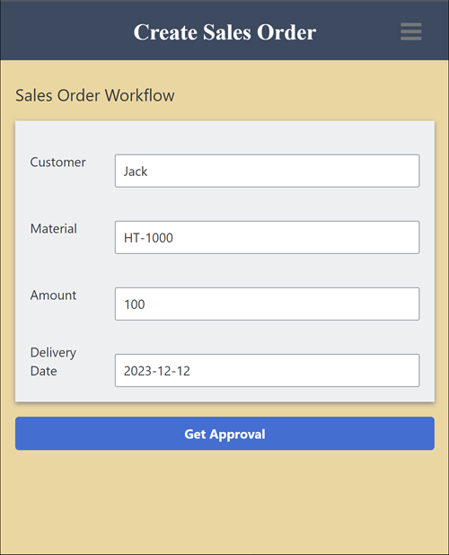

## Create a new app project 

1. From [SAP Build Lobby](https://da160-96ork4sc-applicationdevelopment.lcnc.cfapps.eu10.hana.ondemand.com/lobby), Go to the SAP Build lobby, and click on <b>Create</b>. 

  

2. Select <b>Build an Application.</b>
     
    

3. Select <b>Web & Mobile Application.</b>
       
   

4. For the project name, enter <i>Sales Order Trigger</i> then click <b> Create.</b>
     
    

## Create the sales order page 

1. By default your new application contains a page with title and text fields. In this step, you will focus on turning this page into your app, including how to build a UI and stylize the UI elements.   ![home page]

2. Select the text field, and click the <b> X </b> to delete it.   

3. Click on an open area, and in the <b>Properties</b> tab, change the <b>Page Name</b> to <i>Create Sales Order.</i>   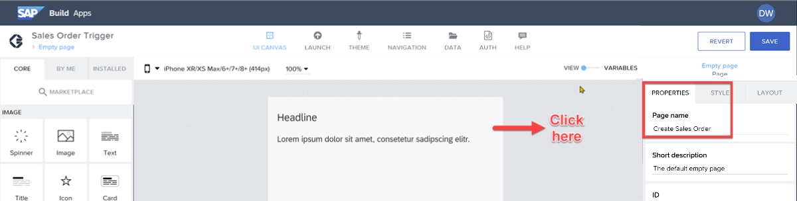

4. Select the <b> Style </b> tab.   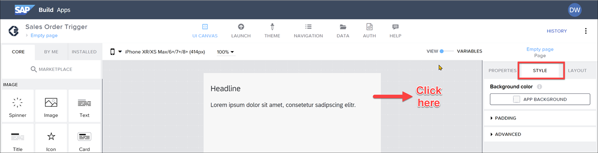

5. Click the <b> Background Color </b> (App Background), and then select New Palette.  ![input properties]

6. For the color, enter _#F3D6A0_, name the color _SAP Orange Light_, and click <b> Save.</b>

7. Click the title field, and in the <b>Properties</b> tab change the <b>Content </b> text to _Sales Order Workflow_.  
   

8. To the canvas, drag a Container component. With the container selected, in the <b> Properties </b> tab under Advanced Properties, change the <b> Component display name </b> to _Form_.

     
   Still with the container selected, open the <b> Style </b> tab, and click <b> Edit </b> for the Layout Container.   
   For the background color, select **Level 4 background.**  
   For padding, set the padding on all 4 sides to 16px by going to **Theme** and selecting the **L** size.     
   For **Effects**, create a shadow by setting these properties:  
   **Enable Shadow** : True  
   **Shadow**: Content Shadow 0  
   **Color** : Any static color you like (I chose #8e8989)  
   Let’s save the style by scrolling up, clicking <b>New Style,</b> entering Layout _Form Container_, and clicking <b> OK.</b>

9. Inside the outer container, add another container, and inside that container add a text and input field. The result should look like this:   
   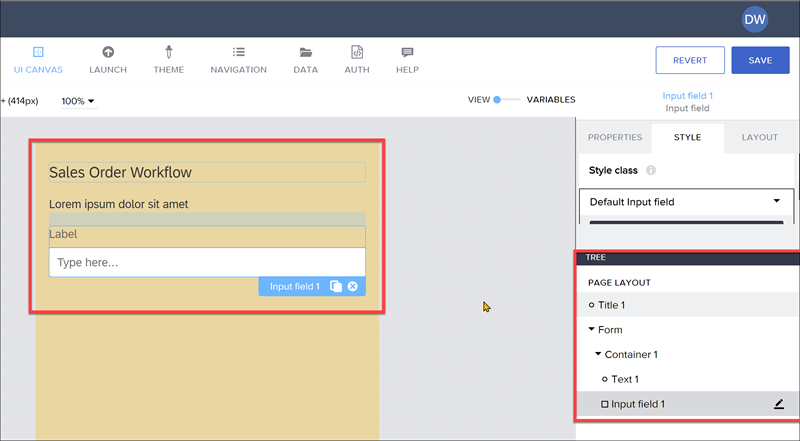   
   For the inner container, go to **Layout** tab, and under **Layout** set the container to **Horizontal**. Then, set **Align components** to middle.  
     
   For the text field, go to **Layout** tab and set the width to exactly 75px. 
   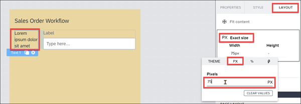 
   For the input field, delete _Label_ from the **Label** property.   

10. From the Tree view, copy the inside container and paste it inside the outer ( Form ) container until you have 4 fields.. 
     
    <b>Fields </b>  
    Ship To Party  
    Material  
    Order Amount  
    Delivery Date 
    

11. At the bottom of the page (outside the outside container), add a button. In the **Properties** tab, set the **Label** to _Get Approval_.   
    

## Enable SAP BTP authentication 

You need to enable SAP BTP authentication since you want to use SAP BTP destinations.

1.  Go to the <b>Auth</b> tab. 

2.  Click Enable <b>Authentication</b>. 
    

3.  Select <b> SAP BTP Authentication.</b> On the confirmation popup, click <b>OK</b>. 

## Create data resource to SAP Build Process Automation 

As part of setting up SAP Build Process Automation, you created a destination so you can make calls to the SAP Build Process Automation APIs, including the one that lets you trigger a workflow.
  
Now you will set up the connection from your app to SAP Build Process Automation on your tenant, using that destination.   
 

1.  Open the **Data** tab, at the top of the page   
2.  Scroll down, and click <b>Create Data Entity > SAP BTP Destination REST API Integration</b>. 
    The configuration screen appears, starting with the **Base** panel.  
    

3.  On the Base panel, enter the following:  
<table>
  <tr>
    <th>Field</th>
    <th>Value</th>
  </tr>
  <tr>
    <td>Data resource name</td>
    <td><i>Trigger Workflow</i></td>
  </tr>
  <tr>
    <td>BTP destination name</td>
    <td><i>sap-process-destination (or the destination you created, if you created your own)</i> </td>
  </tr>
  </table>  

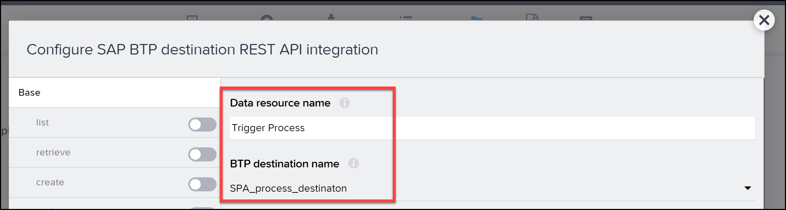

  
Under <b>Resource schema</b>, click Add New and add a field of type <i>Object</i> and with the name **salesorderdetails** .  
Click on the new field, and add the following sub-fields to the object:  

 
<b>IMPORTANT:</b> Click on the <b> Add New </b> button BELOW the salesorderdetails field.   

<table>
  <tr>
    <th>Field Name</th>
    <th>Type</th>
  </tr>
  <tr>
    <td>ShipToPartyl</td>
    <td>Text</td>
  </tr>
  <tr>
    <td>Material</td>
    <td>Text</td>
  </tr>
  <tr>
    <td>OrderAmount</td>
    <td>Number</td>
  </tr>
  <tr>
    <td>ExpectedDeliveryDate</td>
    <td>Text</td>
  </tr>
  <tr>
    <td>Division</td>
    <td>Text</td>
  </tr>
  <tr>
    <td>SalesOrderType</td>
    <td>Text</td>
  </tr>
  <tr>
    <td>ShippingCountry</td>
    <td>Text</td>
  </tr>
  <tr>
    <td>SalesOrganisation</td>
    <td>Text</td>
  </tr>
  <tr>
    <td>DistributionChannel</td>
    <td>Text</td>
  </tr>

</table>

4.  Click the **create** panel. 
    Then enable the create action with the toggle button.  
    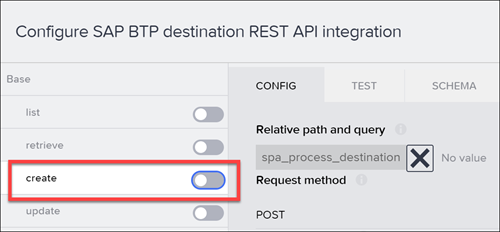  
      

5.  For **Request headers**, click the binding **X**, then **List of values**. 

Click **Add a value**, and add the following key-value pair: 

<table>
  <tr>
    <th>Field Name</th>
    <th>Value</th>
  </tr>
  <tr>
    <td>Header name</td>
    <td>Content-Type</td>
  </tr>
  <tr>
    <td>Header value</td>
    <td>application/json</td>
  </tr>
  </table>
        
        Click <b>Save.</b>

6.  For <b>Request body mapper,</b> click the binding <b> X</b>, then <b>Formula > Create formula.</b> 
    Enter the following for the formula – replace <your definition ID> with the ID for your process:  
    " ENCODE_JSON({ "definitionId": "<your definition ID>", "context": query.record })"   
    Click <b>Save </b>twice.

        

7.  Click **Save Data Resource** (bottom right).  
    Click Save (in the upper right to save all your changes to the project). 
    

## Test the trigger 

1. Open the data resource again by clicking it. 
   

2. Click **create** on the left, and then the **Test tab**.. 

3. Enter values for the fields (really, you only need to enter an order amount), and then scroll down and click **Run Test**.  
   

**IMPORTANT**: Date fields must be in the format of 2022-12-25 and the order amount must be a number.  
If all works **OK**, you will get a **201** status code and a response with information about the process instance you just triggered, something like this:   
Javascript:   
{
"id": "54988e48-8056-11ed-9a13-eeee0a99244a",  
"definitionId": "us10.my-account.salesorderapprovals.orderProcessing",  
"definitionVersion": "6", 
"subject": "Order Processing", 
"status": "RUNNING", 
"businessKey": "54988e48-8056-11ed-9a13-eeee0a99244a", 
"parentInstanceId": null, 
"rootInstanceId": "11118e48-8056-11ed-9a13-eeee0a99244a",  
"applicationScope": "own", 
"projectId": "us10.my-account.salesorderapprovals", 
"projectVersion": "1.0.5", 
"startedAt": "2022-12-20T11:06:19.318Z",  
"startedBy": "sb-clone-41c25609-33a1-9999-97d8-34fcd2316008!b3591|workflow!b116", 
"completedAt": null 
} 
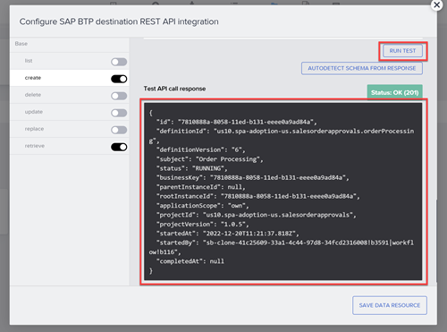  

If you’ve gotten to here, your integration with SAP Build Process Automation is working!! 
You can go into the SAP Build Process Automation monitoring and see there the process you just triggered, and check the context to make sure the parameters were sent properly.  
 
You can also check the Inbox to see the forms were created and the values properly passed into the workflow. 
 

## Create data variable 

1. Back on the UI canvas, select **Variables**. 

2. On the left, click **Data Variables**. 

3. Click **Add Data Variable**, and choose **Trigger Workflow** as the data resource on which to base the data variable.  
   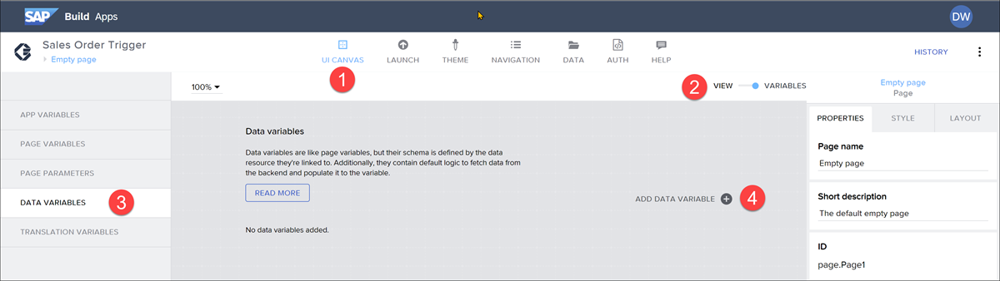

4. On the right, choose **New data record**. 
   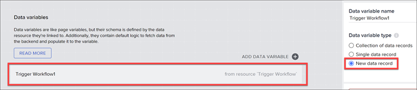

5. Click **Save** (upper right). 

## Bind data variable to UI elements 

1. Go back to **View** so you can see the UI canvas. 

2. Click on the first input field (for **Customer**).
   In the Properties tab, click the **X** next to the **Value** field, and select **Data and Variables > Data Variables > Trigger Workflow1 > shipToParty**. 
   

3. Click **Save**  

4. Click on the second input field (for **Material**).  
   In the Properties tab, click the **X** next to the Value field, and select **Data and Variables > Data Variables > Trigger Workflow1 > material.**  
   Click **Save**  

5. Click on the third input field (for **Amount**).  
   In the Properties tab, click the **X** next to the Value field, and select D**ata and Variables > Data Variables > Trigger Workflow1 > orderAmount.**  
   Click **Save**  

6. Click on the fourth input field (for **Delivery Date**).
   In the **Properties** tab, click the **X** next to the Value field, and select **Data and Variables > Data Variables > Trigger Workflow1 > expectedDeliveryDate.**
   Click **Save**  

7. Click **Save** (upper right).

## Add logic to trigger workflow 

1. Click on the **Get Approval** button, and open the logic canvas by clicking **Add logic to Button1** at the bottom right. 
    

2. Drag a **Create record** flow function onto the canvas, and connect the component tap event to it.   

3. Click on the **Create record** flow function and configure it in the **Properties** pane on the right.
    
   For **Resource name**, this should already be set to **Trigger Workflow**, since you have only one data resource.    
   For **Record** , you have to bind each of the data variable fields to the appropriate record field.  
   There are many ways to do binding. For **Properties** , you will use a formula. Click on the object binding button:     
   Click **Formula** , then click on the existing formula, and replace it with the following:  
   Javascript:  
   {salesorderdetails: {division: "1010", orderAmount: NUMBER(data["Trigger Workflow1"].salesorderdetails.orderAmount), shipToParty: data["Trigger Workflow1"].salesorderdetails.shipToParty, salesOrderType: "OR", shippingCountry: "Barbados", salesOrganisation: "10", distributionChannel: "1000", expectedDeliveryDate: data["Trigger Workflow1"].salesorderdetails.expectedDeliveryDate, material: data["Trigger Workflow1"].salesorderdetails.material}}
    

4. Click **Save**. 

5. Drag a **Toast** flow function onto the canvas, and connect the **top** output of the Create record flow function to it.    

6. Click on the **Toast** flow function and configure it in the **Properties** pane on the right.  
   For **Toast message**, click on the **ABC**, and then select **Formula > Formula**.  
   Erase the quotation marks, and enter the following formula:  
   "Triggered process with ID: " + outputs["Create record"].response.id  
   Click **Save**.
     

7. Click **Save** (upper right).

## Run App 

1. Click the **Launch** tab, and then **Open Preview Portal**.  
     
2. Click **Open web preview** (left).  

3. Select your project, **Select Order Trigger**.    
4. Enter the following values in your form:  
<table>
  <tr>
    <th>Field Name</th>
    <th>Value</th>
  </tr>
  <tr>
    <td>Customer</td>
    <td>Joe's Bikes</td>
  </tr>
  <tr>
    <td>Material</td>
    <td>HT-1000</td>
  </tr>
  <tr>
    <td>Amount</td>
    <td>1000</td>
  </tr>
  <tr>
    <td>Delivery Date</td>
    <td>2023-03-31</td>
  </tr>
  </table>  
5. Click Get Approval.  
   You process should be triggered and require approval (since the amount is 1000 or above).  
   You should see the toast message indicating the workflow was triggered, and with the process instance ID.  

   
   You can also see the results of the call in SAP Build Process Automation.  
   Go to the Monitor tab, then Process and Workflow Instances. The first one should be the one you just triggered. 
   You can see the new process instance. 
   You can see the context, which is the values sent with the API.  
   You can also see the execution log, which in this case ran the auto-approve task because the amount was below 100000. 
   The context field in yellow are the ones that you entered via the UI.  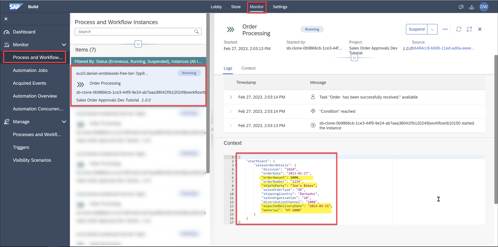
   You can also see that the process instance ID is the same: in the toast message and in the upper right of the Monitor tab.
